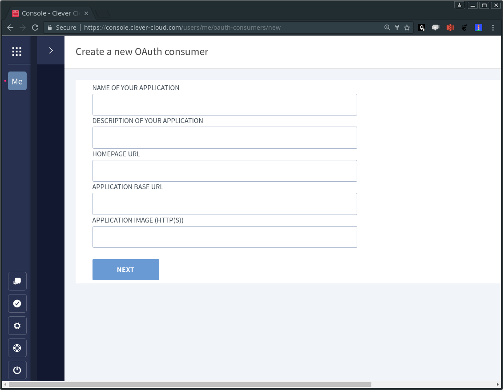
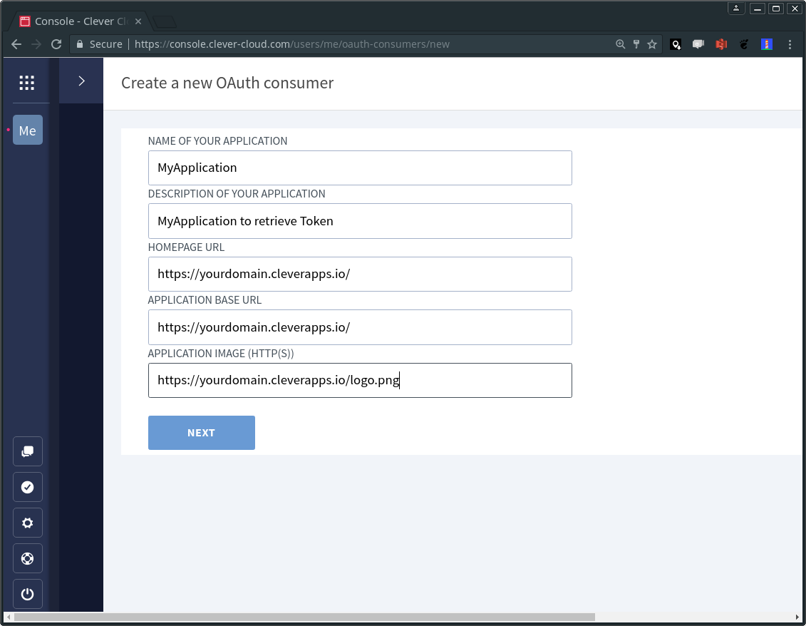
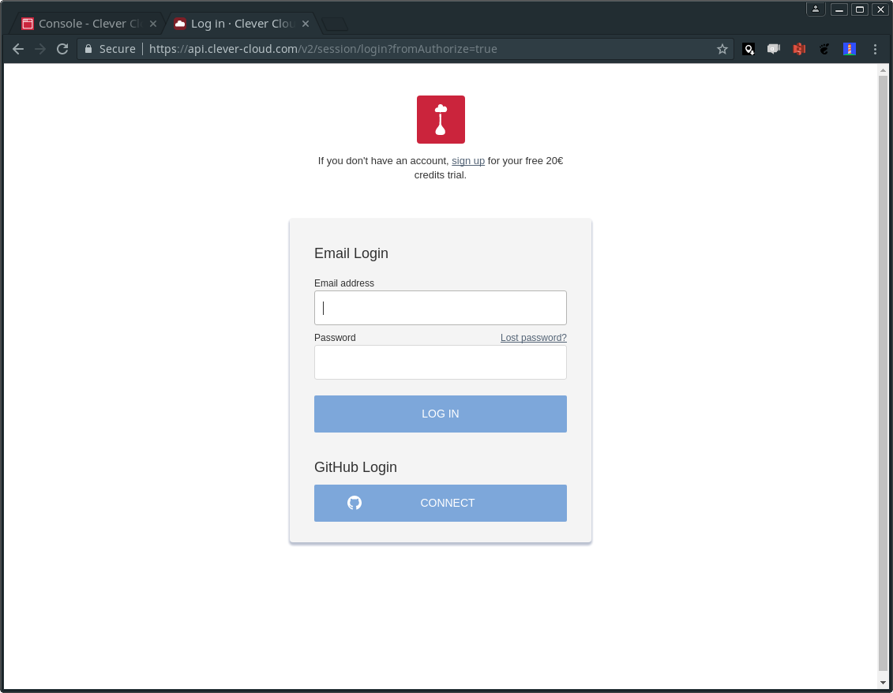
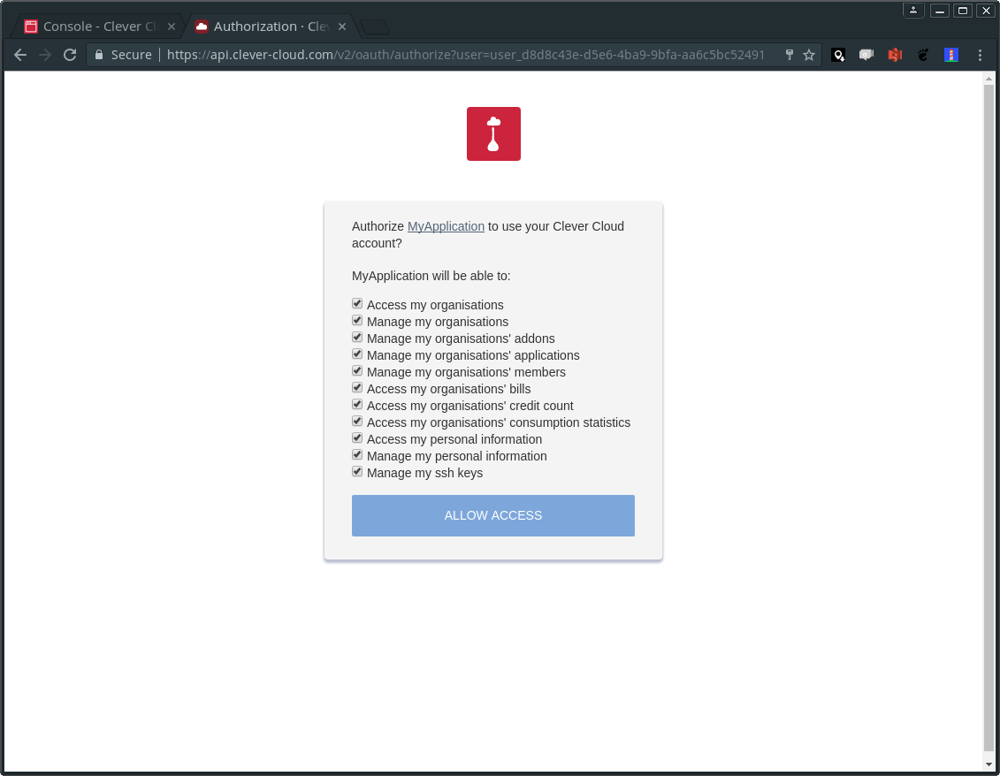
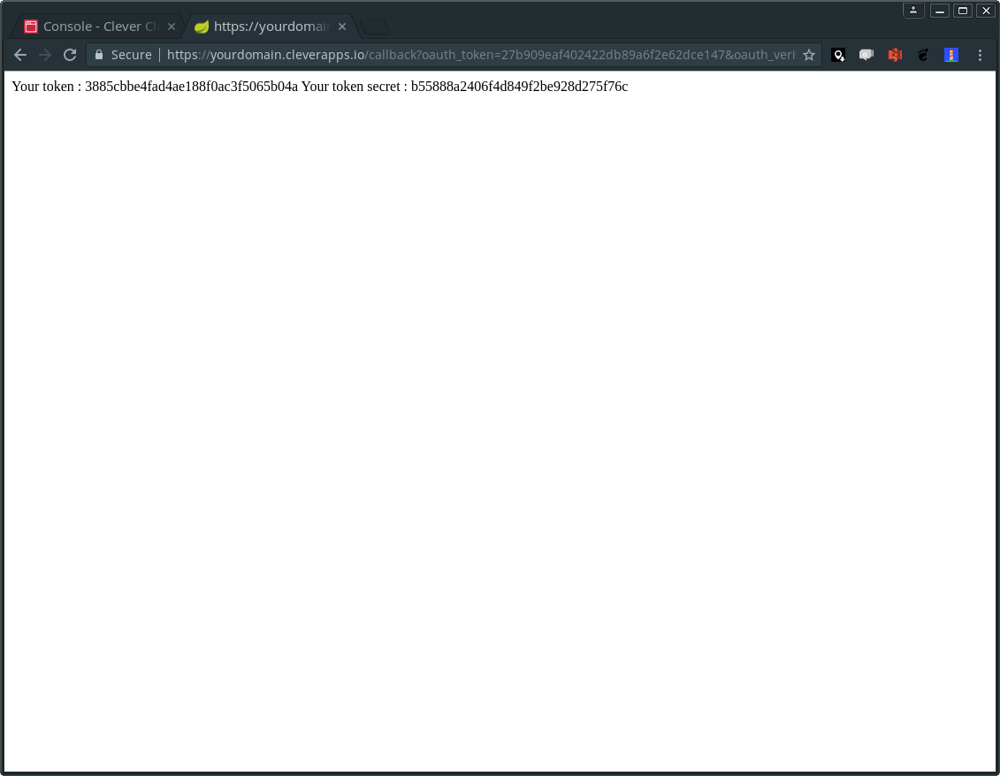

# How to obtain the credentials for the Clever Operator

CTo configure the Clever Operator, you'll need specific OAuth credentials from Clever Cloud. Here's a step-by-step guide on how to obtain these credentials using the Clever Cloud OAuth Consumer Server:

## 1. Prerequisites

Ensure you have [Clever Tools](https://www.clever-cloud.com/doc/clever-tools/getting_started/) installed on your local machine.

## 2. Deploy the OAuth Consumer Server Application

1. **Create the Application:**
  - Open your terminal and execute:
    ```bash
    clever create --type maven yourOauthApp
    ```
  - Replace `yourOauthApp` with your desired application name.

2. **Add a Domain Name:**
  - Assign a domain to your application:
    ```bash
    clever domain add yourdomain.cleverapps.io
    ```
  - Replace `yourdomain.cleverapps.io` with your chosen domain name.

3. **Set the Application URL:**
  - Configure the `APP_URL` environment variable:
    ```bash
    clever env set APP_URL https://yourdomain.cleverapps.io/
    ```
  - Ensure the URL matches the domain you've set.

4. **Deploy the Application:**
  - Deploy your application to Clever Cloud:
    ```bash
    clever deploy
    ```

## 3. Create an OAuth Consumer in the Clever Cloud Console

1. **Access the Console:**
  - Navigate to the [Clever Cloud Console](https://console.clever-cloud.com/).

2. **Create the OAuth Consumer:**
  - Click on "Create an OAuth consumer" or [use this direct link](https://console.clever-cloud.com/consumers).

    

  - Fill in the required fields, ensuring that the callback URLs correspond to the application you've deployed.

    

  - Grant the suggested rights to the consumer

    

  - The `key` and the `secret` fields will be the `Consumer Key` and `Consumer Secret` in the Clever Operator configuration

    

**3. Retrieve Your API Token and Secret**

  After completing the above steps, your application will be set up to retrieve the necessary OAuth tokens. Access your deployed application (e.g., `https://yourdomain.cleverapps.io/`) and login using the `key` and `secret` to obtain the `API Token` and `API Secret`.

  

  
  
  

## 4. Configure the Clever Operator

The variables you need to set are: 

- **API Endpoint**: typically `https://api.clever-cloud.com/v2`
- **Consumer Key** and **Consumer Secret**: from [Deploy the OAuth Consumer Server Application](#2-deploy-the-oauth-consumer-server-application) 
- **API Token** and **API Secret**: from [Create an OAuth Consumer in the Clever Cloud Console](#3-create-an-oauth-consumer-in-the-clever-cloud-console)

With them, configure the Clever Operator by setting the appropriate environment variables or updating the configuration files as detailed in the [Clever Operator documentation](https://github.com/CleverCloud/clever-operator).

By following these steps, you'll have the necessary credentials to configure the Clever Operator for seamless integration with Clever Cloud's services. 